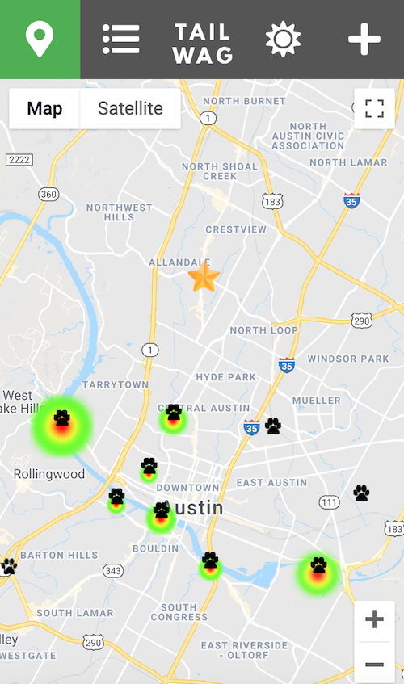

# Tailwag
An app for finding and sharing local dog parks.

### The Problem
Dog owners in Austin, TX, love spending time outside with their pups. But after a quick Google search of "dog parks in Austin," only about 10 results pop up. Now, we know that can't be true... What about all of those local spots that only seasoned dog owners know about? The places that aren't technically dog parks, but that are still dog-friendly, and even dog-encouraged.

### What Is Tailwag?
Tailwag is an online resource for local dog owners to find and post about their favorite dog parks in town. When a user first logs onto Tailwag, they will see a map filled with pins of dog parks near their current location. They can click the pin for more information about the park, such as:
* How many miles away the park is
* How many people are currently at the park
* Whether or not the park requires a leash, is fenced in, has shaded areas, has a swimming hole, etc.

Dog owners can also add their own dog park to the map by simply entering a name, selecting features, and dropping a pin.

Our hope is that Tailwag helps dog owners find and share new spaces and places to hang out with their furry friends. Keep wagging!

